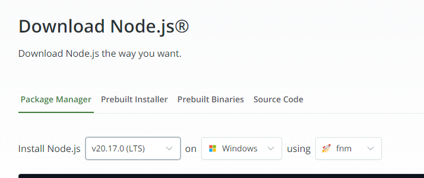
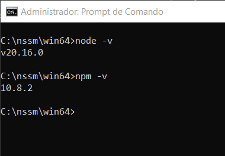
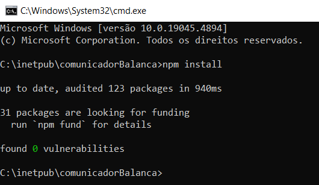
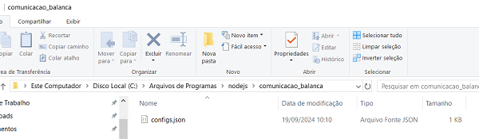
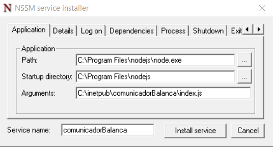
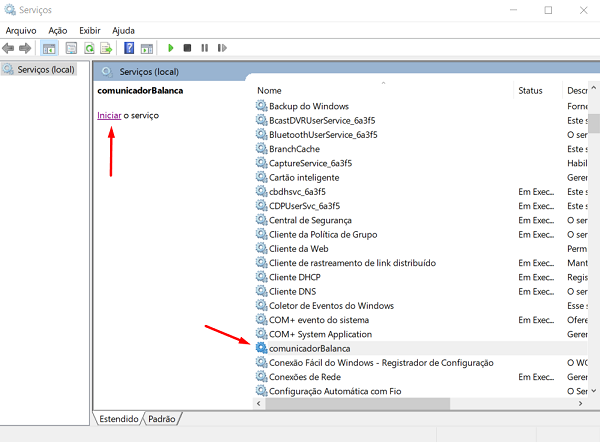

# API em Node.js para se comunicar com a balança toledo

## 1. Instale o Node.js
Acesse o link e instale o Node.js na ultima versão LTS [Node.js](https://nodejs.org/en/download/package-manager/current)

Execute no CMD **node -v** e **npm -v** se mostrar a versão significa que está instalado

## 2. Instale a API de comunicação com a balança
### Baixe o projeto [Link do projeto](https://github.com/GuilhermeEK23/comunicadorBalanca/archive/refs/heads/main.zip)  

- Escolha uma pasta para salvar o projeto pode ser C:\inetpub

- Abra a pasta do projeto no cmd e execute **npm install**  

### Crie uma pasta chamada **comunicacao_balanca** no caminho *C:\Program Files\nodejs*

- Após isso mova o arquivo configs.json do projeto para esta pasta *C:\Program Files\nodejs\comunicacao_balanca*  

### Baixe o [NSSM](https://nssm.cc/release/nssm-2.24.zip) extraia o arquivo na pasta *C:\\* e renomeie a pasta para **nssm**

- Abra o cmd como admnin e acesse a pasta *C:\nssm\win64* e execute o seguinte comando para instalar o serviço no windows  
**nssm install comunicadorBalanca**  
Irá abrir a seguinte tela:  
  
Path: (*Caminho do executável do Node.js*)  
Startup Directory: (*Puxa sozinho, pasta onde se encontra o Node.js*)  
Arguments: (*Arquivo index.js do projeto*)  

- Clique em Install Service

### abra o executar e digite *services.msc* e procure pelo serviço instalado e clique em iniciar  
  

## 3. Feito isso o utilizando a conexão via WebSocket **ws://localhost:4000** enviando o comando **socket.send('solicitarPeso')** já vai receber o peso
